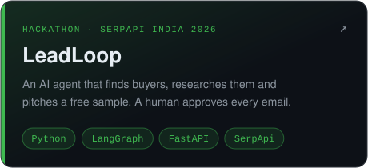
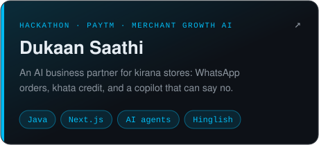
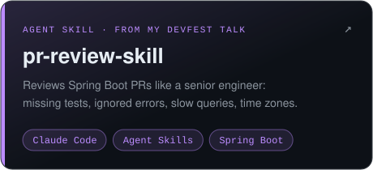

<a href="https://contact-shubham.vercel.app/">
  
</a>

<p align="center">
  <a href="https://contact-shubham.vercel.app/"></a>
  <a href="https://linkedin.com/in/itshubham"></a>
  <a href="mailto:dev2shubham@gmail.com"></a>
  <a href="https://x.com/contactshubham"></a>
  
</p>

<p align="center"><i>"Anything, but not everything."</i></p>

## `$ cat application.yml`

```yaml
shubham:
  role: senior software engineer · full stack
  based-in: delhi ncr, india
  day-job: qss technosoft            # since 2022, key contributor 2025
  ships: [spring boot apis, angular uis, releases on aws + gcp]
  favourite-bug: the one that only happens in a US time zone
  superpower: finding why a system is slow   # unused index, blocked thread, missing cache
  learning: [java 21 virtual threads, ai agents, aws solutions architect]
  off-duty: table tennis 🏓
  open-to: interesting backend problems, talks, hackathons
```

## 🎤 On stage

<a href="https://github.com/heyitshubham/pr-review-skill">
  
</a>

## 🏗️ Biggest thing I've built at work



<details>
<summary><b>🐛 Bug journal: production problems I've tracked down</b> (click to open)</summary>
<br />

| Symptom | Real cause | Fix |
|---|---|---|
| Order search read **every row** | Search terms were passed as an array, which a `GIN (pg_trgm)` index can't use | Rewrote the condition so all three indexes were used again: **full table scan → index lookup** |
| Shared service code **froze under load** | Deadlock between threads | Found the deadlock and moved the work from one-at-a-time to parallel |
| Bugs only **US customers** saw | Failures depended on **time zone and locale** | Recreated the customer environment locally; supported releases in US hours |
| Bulk product enrichment **held up releases** | One record processed at a time | `ExecutorService` + `CompletableFuture`, thread-safe with `AtomicInteger` |
| Kiosk queue screens **showed stale data** | Client-side GraphQL cache | Turned off Apollo caching for live queues so the screen always matches the room |
| Angular v9 upgrade **"too risky to try"** | Nine major versions behind | Upgraded **v9 → v20** one version at a time, moved 30+ modules to standalone, **no downtime** |

</details>

## 🚀 Things I build after hours

<table>
  <tr>
    <td width="50%"><a href="https://github.com/heyitshubham/LeadLoop"></a></td>
    <td width="50%"><a href="https://github.com/heyitshubham/dukaan-saathi"></a></td>
  </tr>
  <tr>
    <td width="50%"><a href="https://github.com/heyitshubham/pr-review-skill"></a></td>
    <td width="50%"><a href="https://github.com/heyitshubham/type-tank-game"></a></td>
  </tr>
</table>

## 🧰 Toolbox

| | |
|---|---|
| **Backend** |  |
| **Frontend** |  |
| **Data & messaging** |  |
| **Cloud & delivery** |  |
| **AI-assisted dev** | `Claude Code` · `MCP` · `Agent Skills` · `Cursor` · `LangGraph` |

## 🏆 Trophy shelf

| | |
|---|---|
| 🥇 | **Key Contributor 2025**, QSS Technosoft, for technical leadership and mentoring |
| 🎤 | **Speaker**, DevFest Noida 2026: *"AI Writes Your Code. Who Checks It?"* |
| 🏅 | **7th place**, Smart India Hackathon 2022, as backend team lead |
| 🥇 | **1st place**, Pitch-a-Biz business prototype competition, as technical lead |
| ⚔️ | Built for **SerpApi India Hackathon 2026** and **Paytm Hackathon** (2026) |
| ☁️ | **AWS Certified Solutions Architect – Associate**, in progress |

## 🐍 Contributions, eaten

<picture>
  <source media="(prefers-color-scheme: dark)" srcset="https://raw.githubusercontent.com/heyitshubham/heyitshubham/output/github-snake-dark.svg" />
  <source media="(prefers-color-scheme: light)" srcset="https://raw.githubusercontent.com/heyitshubham/heyitshubham/output/github-snake.svg" />
  
</picture>

<p align="center">
  <code>➜ ~ exit</code> &nbsp;·&nbsp; thanks for scrolling this far. Say hi at <a href="mailto:dev2shubham@gmail.com">dev2shubham@gmail.com</a> 👋
</p>


